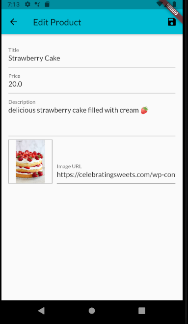

# My_Shop

## Topics Learned:

* [State Management](docs/state_management.md)
* [User Inupt](docs/user_input.md)
* [Http Request](docs/http_request.md)
* [User Authentication](docs/user_auth.md)
* [Animation](docs/animation.md)

Auth Screen

The auth screen uses Firebase Auth REST API and saves
the token. 

Grid View Screen

I'm using a GridView.builder to create my grid products screen. Here is the
documentation for GridView: [Documentation](https://api.flutter.dev/flutter/widgets/GridView-class.html). The GridView.builder takes in a list and uses `itemBuilder` to loop through all the products in my list. I'm also using a Consumer widget instead of setState() to wrap around my Product. 

Cart Screen

I used a ListView.builder to display my different CartItems and loop through every item in my list.

Order Screen

Product Screen

