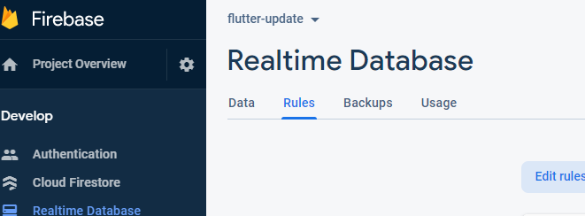
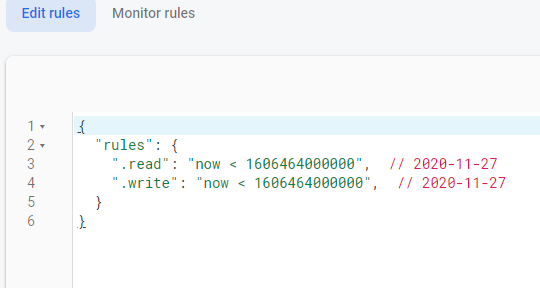

# Http Request

* Storing Data & Http
* Sending Http Requests(Store & Fetch Data)
* Show Loading Progress
* Handling Errors

## Storing Data & Http

You want to store things so that it is saved when you refresh or restart your application. The two options for storing are
on-device storage and web storage. 

On-device storage is useful for offline applications and storing data on a single device. The data persists across
app restarts, but it is ONLY available to one user. 

Web storage stores data across different devices, so that many users can access your application. Web storage requries internet
connection and data persists across app restarts.


## Web storage with Firebase

Firebase acts as a medium between my application and a database. Also, it can be used as a database, web server, authentication, and more. Without Firebase or something similar, the connection between my app and the database is complex and insecure because the app has to hold database credentials(username, password). Additionally, a user could get a hold of the database credentials and change your data. Firebase takes care of these credentials and other properties. 

This structure of using a medium can be used with other databases such as MongoDB and postgreSQL

## Send Http Request
I'm using the [http package](https://pub.dev/packages/http) from dart to send requests. First, I assign the Firebase url to a variable in my code. I use `http.post` to push new product information to the Firebase url and update the database. There is another method called `http.patch` that updates an existing entry. 

In the example below, the body needs to be encoded with `json.encode` from `dart:convert`. The product information is stored in a Dart map, but Firebase accepts json code which is why I use `json.encode`.

```dart
http.post(
        url,
        body: json.encode({
          'title': product.title,
          'description': product.description,
          'imageUrl': product.imageUrl,})
```

## Futures
There are two different ways to run async code in a Future.

1. Await and Async
2. .then() and catchError()

You should use await when handling http requests and when data is passed around web servers. 

```dart
Future<void> addProduct(Product product) async {
    const url = 'https://flutter-update-4f3cd.firebaseio.com/products.json';
    try {
      final response = await http.post();
```

## Error handling
You can use the try and catch features of Dart to handle sections of code that are more 'prone' to errors. For example, when dealing
with Http requests there is more oppurtunity for an error because the user could have poor internet connection or input invalid information. 
When you catch an error then we can use `showDialog` to show an `AlertDialog()` message. 


```dart
 try {
        await Provider.of<Products>(context, listen: false)
            .addProduct(_editedProduct);
      } catch (error) {
        await showDialog<Null>(
            context: context,
            builder: (ctx) => AlertDialog(
                  title: Text('An Error Occured!'),
                  content: Text('Something went wrong'),)}
```

## Loading Spinner
In the products overview screen, I use the _isLoading variable to check when my app is loading. I first set _isLoading to true when it is initiliazing the state inside of `didChangeDependcies()`. I then use the `.then()` method after the `fetchAndSetProducts()` to set _isLoading to false. If _isLoading is true, then I display a CircularProgressIndicator. Else, I display the ProductsGrid.  

```dart
void didChangeDependencies() {
    if (_isInit) {
      setState(() {
        _isLoading = true;
      });

      Provider.of<Products>(context, listen: false)
          .fetchAndSetProducts()
          .then((_) {
        setState(() {
          _isLoading = false;
        });

...
body: _isLoading
          ? Center(child: CircularProgressIndicator())
          : ProductsGrid(_showOnlyFavorites),
```

### Updating "Favorite" Status Optimistically
Previously, the favorite status wasn't saved when I restarted my app. After implementing a patch request, I was able to update the `isFavorite` status of a product. 

1. Save the isFavorite status inside of oldStatus in case of an error.
2. Toggle isFavorite 
3. Try to save the isFavorite status in Firebase by using the `patch` request from http.
4. If the request fails, then catch the error and revert isFavorite back to oldStatus. 

```dart
Future<void> toggleFavoriteStatus() async {
    final oldStatus = isFavorite;

    isFavorite = !isFavorite;
    notifyListeners();
    final url = 'https://flutter-update-4f3cd.firebaseio.com/products/$id.json';
    try {
      final response = await http.patch(
        url,
        body: json.encode(
          {'isFavorite': isFavorite},
        ),
      );
      if (response.statusCode >= 400) {
        _setFavValue(oldStatus);
      }
    } catch (error) {
      isFavorite = oldStatus;
      notifyListeners();
      print(error);
    }
  }
```

The catch error check only works for `post` and `get`. It doesn't throw an error for `patch`, `put`, and `delete`. For these methods, you need to 
check if the http status code is greater than 400. 

### Status Codes
* 100 - Information response
* 200 - Successful response
* 300 - Redirection message
* 400 - Error
* 500 - Server error

## Future.delayed
We call initState because it runs before the build method and we want to fetch the orders before running the build method. We use the Future.delayed function inside of the initState, so that we can send a request to fetch orders. The Future.delayed
function runs after the state is initialized. 

## Fetch and Set 
When I fetch my orders from firebase it returns json. In order to use it, I have to decode the response into a Map. I want to display the orders on the screen as a list of orders from firebase. After fetching data from firebase, I assign each item into a list of orders.

I then use the forEach method to loop through my map and builds a list of loadedOrders.

## FutureBuilder
FutureBuilder determines the current state of a future and can choose what to show when data is loading. Futurebuilder uses `future:` and `builder:` methods. In the `builder:` method we can check the state of the future with `connectionState` and display a loadingSpinner if it's busy. 

```dart
body: FutureBuilder(
    future:
        Provider.of<Orders>(context, listen: false).fetchAndSetOrders(),
    builder: (ctx, dataSnapshot) {
      if (dataSnapshot.connectionState == ConnectionState.waiting) {
        return Center(
          child: CircularProgressIndicator(),
        );
      }
```

## Firebase Rules
My problem was that firebase shuts off access to my database after a certain timeframe. Thus, I lost
access to my old database for Shop App. My solution was to change the rules to one month from now. 

This is my error:
```
 [ERROR:flutter/lib/ui/ui_dart_state.cc(177)] Unhandled Exception: type 'String' is not a subtype of type 'int' of 'index'
E/flutter (17846): #0      Products.fetchAndSetProducts
package:flutter_complete_guide/providers/products.dart:94
E/flutter (17846): <asynchronous suspension>
```

This is my solution:





