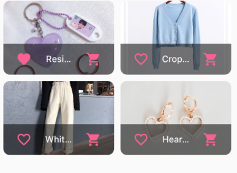

## State Management

Passing data between multiple levels of an app can be confusing because you have to pass it through various constructors.

```dart
class Level1 extends StatelessWidget {
  final String data;
  Level1(this.data);
  @override
  Widget build(BuildContext context) {
    return Container(child: Level2(data));
  }
}
```

As the number of levels increase, the data is passed through more and more constructors so the problem becomes bigger. 

```dart
class Level2 extends StatelessWidget {
  final String data;
  Level2(this.data);
  @override
  Widget build(BuildContext context) {
    return 
        Level3(data), }}
```

Because of this problem, it is recommended to use a provider widget. The core concept is that the widgets have a listener that listens for changes in the state. 

<image src="images/provider.png" width=50%>

## Provider Implementation
1) import provider package from dart packages
2) Wrap MaterialApp with Provider widget
3) Add `create` property that returns the information you want to pass down. 

```dart
import 'package:provider/provider.dart';
...

class MyApp extends StatelessWidget {
  final String data = 'Top Secret Data';

  @override
  Widget build(BuildContext context) {
    return Provider<String>(
      create: (context) => data,
      child: MaterialApp())}}
```

4) Access data in other widget using `Text(Provider.of<String>(context));`

```dart 
class Level3 extends StatelessWidget {
  @override
  Widget build(BuildContext context) {
    return Text(Provider.of<String>(context));
  }
}
```

## ChangeNotifier

For more complex data passing that updates the state you should use the ChangeNotifier class which is built in Flutter. First, add a Data class that extends ChangeNotifier to hold the data.

```dart
class Data extends ChangeNotifier {
  String data = 'Some data';
}
```

Next, change Provider class to ChangeNotifierProvider that accepts `<Data>` and creates `Data()`.

```dart
return ChangeNotifierProvider<Data>(
  create: (context) => Data(),
  child: MaterialApp()
)
```

In order to access the data in Data() class, use `Text(Provider.of<Data>(context).data)`.

```dart
class Level3 extends StatelessWidget {
  @override
  Widget build(BuildContext context) {
    return Text(Provider.of<Data>(context).data);
  }
}
````

I added a method to my Data class called changeString() that updates the data with a new value. The last line calls notifyListeners() which tells all the listeners to update their values!

```dart
class Data extends ChangeNotifier {
  String data = 'Some data';

  void changeString(String newString) {
    data = newString;
    notifyListeners();
  }
}
```

Next, I changed MyTextField() to call changeString() and passed it a value from it's onChanged method. The important feature is to add `listen: false` which is required for Stateless widgets in the version of provider package I'm using. 

```dart
 return TextField(
      onChanged: (newText) {
        Provider.of<Data>(context, listen: false).changeString(newText);
      },
    );
```

# Concept
This first section of Shop App focused on managing the state and utilizing the Provider widget to update certain parts of the app. We have many screens in this app that pass information to each other using state management.

## Consumer Widget
I learned that there is a different way to update the state, in place of `Provider.of`. The reason we use the `Consumer` widget is that it only updates the specific widget that it wraps around. The `Consumer` widget calls the individual build method of a widget, while `Provider.of` rebuilds the entire screen. In my product_item.dart file, I used the `Consumer` widget to change the favorited status of my products. When using the `Consumer` widget, we can have a stateless widget that takes in the Provider classes from main.dart.

```dart
class ProductItem extends StatelessWidget {
 Widget build(BuildContext context) {
    final product = Provider.of<Product>(context, listen: false);
    final cart = Provider.of<Cart>(context, listen: false);

```
My Consumer widget will only update the Icon button when the favorite status is changed. We use Consumer instead of  setState() because the favorite status is an app-wide state, not local state. 
```dart
Consumer<Product>(
  builder: (ctx, product, _) => IconButton(
    icon: Icon(
        product.isFavorite ? Icons.favorite : Icons.favorite_border),
    onPressed: () {
      product.toggleFavoriteStatus();
    },
```



## Stateful Widget
You use the stateful widget when the state you're dealing with is a local state. Local state resides in only one part of your app. You would use `Provider` widget when the state is an app-wide state and is used in various screens. 

## Lower Level Provider
You can also create a Provider class at a lower level in your app. For example, in my products_grid.dart, I made a new Provider class for individual products.

```dart
 return GridView.builder(
      padding: const EdgeInsets.all(10.0),
      itemCount: products.length,
      itemBuilder: (context, index) => ChangeNotifierProvider.value(
        value: products[index],
        child: ProductItem()))
```

[Home](../README.md)