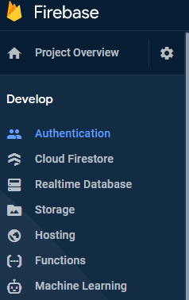

# User Authentication & Auth Status Management

## Learning Topics
* How authentication works in Flutter Apps
* Signup & Login
* Managing User Sessions

I created a new authentication screen that will capture the user's email and password. I'm
using [Firebase](https://firebase.google.com/docs/auth) for my authentication. 

This image shows how authentication is just a feature of Firebase in the menu.

This is the link to the firebase REST API docs: [Firebase Auth REST API](https://firebase.google.com/docs/reference/rest/auth)

