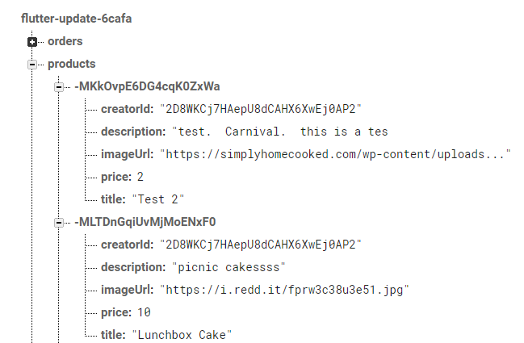

# User Authentication & Auth Status Management

## Learning Topics
* How authentication works in Flutter Apps
* Signup & Login
* Managing User Sessions

I created a new authentication screen that will capture the user's email and password. I'm
using [Firebase](https://firebase.google.com/docs/auth) for my authentication. 

This image shows how authentication is just a feature of Firebase in the menu.


This is the link to the firebase REST API docs: [Firebase Auth REST API](https://firebase.google.com/docs/reference/rest/auth)

## Tokens
The token is used to track the user's login state, so that they don't have to login again. After I authenticate the user, I pull the user's token, expiryDate, and userId.

```dart
_token = responseData['idToken'];
      _userId = responseData['localId'];
      _expiryDate = DateTime.now()
          .add(Duration(seconds: int.parse(responseData['expiresIn'])));
          notifyListeners();
```
The parameters `idToken`, `localId`, and `expiresIn` are found in the [Firebase Auth Documentation](https://firebase.google.com/docs/reference/rest/auth#section-sign-in-email-password). 


### Sending Token Back
You need to send the token back to identify the user with their information. In order to
send the token back, we use a question mark `?auth=$authToken` in the url. 

```dart
final url = 'https://flutter-update-6cafa.firebaseio.com//products.json?auth=$authToken';
```

### ChangeNotifierProxyProvider

When do we use the ChangeNotifierProxyProvider?

We use it when ChangeNotifierProvider is passed a value that needs to be updated. For example, 
if `auth` was updated, then the ChangeNotifierProvider wouldn't have updated accordingly. 
To solve this problem we use ChangeNotifierProxyProvider because it will update if the
`auth` updates. 

 


```dart
ChangeNotifierProxyProvider<Auth, Products>(
          update: (ctx, auth, previousProducts) => Products(auth.token, previousProducts == null ? [] : previousProducts.items),
          create: null,
        ),
```

You need to send the token from authScreen over into the product.dart file. To do this, we use the [`ChangeNotifierProxyProvider`](https://pub.dev/documentation/provider/latest/provider/ChangeNotifierProxyProvider-class.html) class. The ternary operator checks to see whether previousProducts is a new list or not. A new list would mean that previousProducts == null, so we create an empty list. Else, Products() is passed the previousProducts. 

## Attaching "Favorite" Status to specific user

To attach the "favorite" status to a specific user, I used the `userId` in the url to connect my app to Firebase. I also changed the favorite status to be a boolean variable, so that the favorite status is saved as true or false per user.

```dart
url = 'https://flutter-update-6cafa.firebaseio.com/userFavorites/$userId.json?auth=$authToken';
      final favoriteResponse = await http.get(url);
```

## Server Side Filtering with Users

I altered the url to include the filtering of `userId` and `creatorid`. I sent more filtering requirements to Firebase when `filterByUser` is equal to true. It is important to filter on the server side because it takes less work by the user application. When I first restart the app, `filterByUser` is set to false, so we see all of the products. Once we navigate to manage products, we only see the user products. 



```dart
Future<void> fetchAndSetProducts([bool filterByUser = false]) async {
    final filterString = filterByUser ? 'orderBy="creatorId"&equalTo="$userId"' : '';
    var url = 'https://flutter-update-6cafa.firebaseio.com/products.json?auth=$authToken&$filterString'; }
```


We need to set up the rules, so that products accepts creatorId. 

## auto-logout
