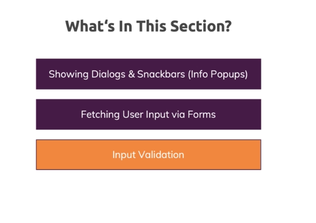
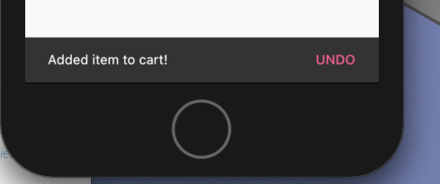

# User Input



## Snack Bar
I learned that we can access another Scaffold within a file using `Scaffold.of(context)` to recieve the closest Scaffold. I then used the `showSnackBar` method and passed in a `SnackBar()` to display a text message on the bottom of the screen. 

```dart
Scaffold.of(context).showSnackBar(SnackBar(
    content: Text(
        'Added item to cart!',),
    duration: Duration(seconds: 10),
    action: SnackBarAction(
        label: 'UNDO',
        onPressed: () {
        cart.removeSingleItem(product.id);
        },),));
```



## Form
We are going to improve the way that we collect the user input using the Form widget. Previously, we used TextEditingControlls to manage the user data. 

### GlobalKey
I used the `GlobalKey<FormState>` to create a new variable that acts as a unique identifier to my form. The `save()` is built into Flutter and calls save on the entire Form widget. 

```dart
  final _form = GlobalKey<FormState>();
  void _saveForm() {
    _form.currentState.save();
  }
  ...
  child: Form(
          key: _form,)
```
[save() Documentation](https://api.flutter.dev/flutter/widgets/FormState/save.html)

[Global Key Documentation](https://flutter.dev/docs/cookbook/forms/validation)

### Validation


In the indivdual TextFormFields we can validate the values using the validator parameter and calling an anonymous function. Inside of the function, we can apply a variety of `if` checks to see if the value isEmpty. We can also apply other checks. These checks include checking if the value is null or checking if the value of the double is greater than 0. If the value is not valid, then it returns a String which is an error. If it is valid, then it returns a null value. 

```dart
validator: (value) {
    if (value.isEmpty) {
      return 'Please provide a value';
    }
    if (double.tryParse(value) == null) {
      return 'Please enter valid number.';
    }
    if (double.parse(value) <= 0) {
      return 'Please enter a number greater than 0';
    }
    return null;
  },
```

You can check whether the form is valid using a method called validate() on the current state of your form. If the form is not valid then I return nothing.

```dart
  void _saveForm() {
    final isValid = _form.currentState.validate();
    if (!isValid) {
      return;
    }
    _form.currentState.save();
    print(_editedProduct.title);
    print(_editedProduct.description);
    print(_editedProduct.price);
    print(_editedProduct.imageUrl);
  }
```
[Home](../README.md)